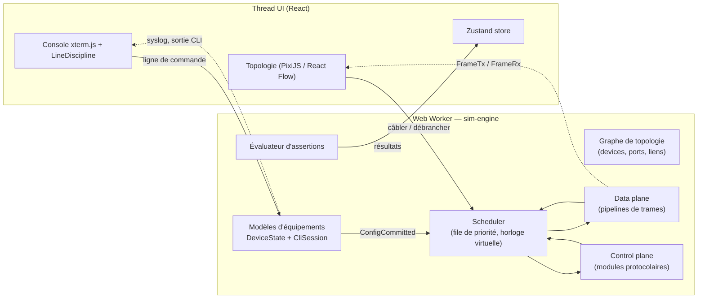
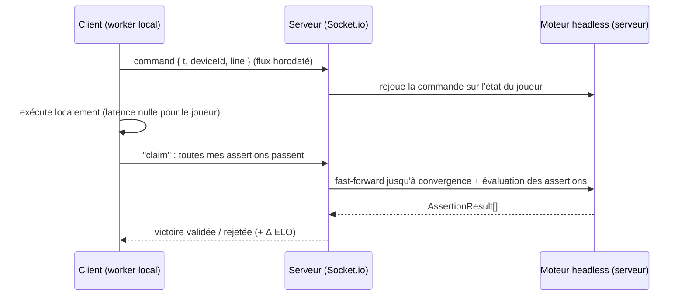

# Architecture du moteur de simulation réseau

> Statut : **conception v0**. Le prototype actuel (`packages/cli-engine`)
> implémente la couche CLI et le modèle d'état des équipements. Le moteur
> d'événements décrit ici (`packages/sim-engine`) est la prochaine étape.

## 1. Objectifs et contraintes

| Contrainte | Conséquence sur le design |
|---|---|
| **Même résultat côté client et serveur** (ranked, anti-triche) | Moteur **déterministe** : horloge virtuelle, file d'événements totalement ordonnée, RNG seedé, aucun `Date.now()` / `Math.random()` dans le moteur. |
| Mode simulation pas-à-pas (animation des paquets) | Le moteur expose chaque événement consommé ; l'UI ne fait que les *observer*. |
| Mode temps réel fluide dans le navigateur | Le moteur tourne dans un **Web Worker** ; le thread UI ne reçoit que des diffs. |
| Validation automatique des défis | L'état est interrogeable (tables MAC/ARP/routage, statuts d'interfaces) par un évaluateur d'assertions déclaratives. |
| Extensibilité (STP, OSPF, ACL, DHCP…) | Chaque protocole est un **module** branché sur des hooks du pipeline, pas un `if` dans le cœur. |

Le moteur est un **simulateur à événements discrets** (DES) : il ne
« tourne » pas en continu, il saute d'un événement daté au suivant.

## 2. Vue d'ensemble



Le serveur exécute **exactement le même paquet** `sim-engine` en headless
(Node/Bun, `worker_threads`) pour valider les matchs classés (§ 8).

## 3. Modèle de données

### 3.1 Topologie

La topologie sérialisée (`Topology` dans `@cpt/shared`) est stockée dans
`Challenge.initialTopology`. Au chargement, elle devient un graphe :

```ts
interface SimPort {
  id: PortId;                 // "SW1:FastEthernet0/1"
  deviceId: DeviceId;
  link: LinkId | null;
  /** Négocié à la connexion (auto-MDIX, speed, duplex). */
  phy: { speedMbps: 10 | 100 | 1000; duplex: "full" | "half"; up: boolean };
}

interface SimLink {
  id: LinkId;
  cable: "copper-straight" | "copper-crossover" | "fiber";
  a: PortId;
  b: PortId;
  /** Délai de propagation virtuel, en µs. */
  delayUs: number;
}
```

Règles de couche physique appliquées à la connexion d'un câble :

- **Compatibilité du câble** : droit entre équipements de classes différentes
  (hôte↔switch), croisé entre équipements identiques ; l'auto-MDIX (activé
  par défaut sur les ports Gigabit) accepte les deux. Fibre uniquement entre
  ports SFP.
- **Négociation** vitesse/duplex : min des capacités ; duplex forcé d'un côté
  et auto de l'autre ⇒ *duplex mismatch* (collisions tardives simulées = perte
  de paquets aléatoire seedée). Scénario idéal pour les défis de dépannage.
- Le lien passe `up` si les deux ports sont `adminUp` et le câble compatible :
  le moteur appelle alors `CliSession.setCarrier()` sur chaque extrémité, qui
  produit les messages `%LINK-3-UPDOWN` / `%LINEPROTO-5-UPDOWN` (déjà implémenté).

### 3.2 État d'un équipement

`DeviceState` (voir `packages/cli-engine/src/types.ts`) sépare :

- la **configuration** (écrite par la CLI) : hostname, interfaces, VLANs,
  routes statiques, et plus tard ACL, process OSPF, pools DHCP… ;
- l'**état opérationnel** (écrit par le moteur uniquement) : `carrier`, table
  MAC, table ARP, RIB/FIB, état STP des ports, voisins OSPF.

La CLI ne lit l'état opérationnel que pour l'afficher (`show …`). Cette
séparation stricte est ce qui permet de rejouer une partie à partir du seul
journal de commandes.

## 4. Scheduler et horloge virtuelle

```ts
interface SimEvent {
  at: number;        // temps virtuel en µs
  seq: number;       // compteur monotone, départage les événements simultanés
  kind: EventKind;
  target: DeviceId | LinkId;
  payload: unknown;
}

type EventKind =
  | "LinkStateChanged"   // câble branché/débranché, shutdown/no shutdown
  | "FrameTx"            // une trame quitte un port
  | "FrameRx"            // une trame arrive sur un port (FrameTx + delayUs)
  | "TimerFired"         // vieillissement MAC/ARP, hello STP/OSPF, dead timers…
  | "ConfigCommitted"    // une commande CLI a modifié la configuration
  | "AppRequest";        // ping, traceroute, requête DHCP/DNS/HTTP d'un hôte
```

- File de priorité (tas binaire) ordonnée par `(at, seq)` ⇒ ordre total,
  donc exécution **déterministe** quelle que soit la machine.
- Un `SeededRandom` (ex. xoshiro128\*\*) est injecté pour tout aléa (pertes
  sur duplex mismatch, jitter des hellos, choix d'ID de transaction DHCP).
- Trois modes d'exécution partagent la même boucle `step()` :

| Mode | Boucle | Usage |
|---|---|---|
| **Temps réel** | à chaque frame (`requestAnimationFrame` côté worker via `setTimeout`), consommer les événements jusqu'à `virtualNow = wallElapsed × speed` | usage normal, matchs |
| **Pas-à-pas** | un `step()` par clic « Suivant » ; filtre optionnel par protocole (ICMP, ARP, DHCP, TCP) | mode simulation / pédagogie |
| **Fast-forward** | consommer jusqu'à quiescence (file vide ou uniquement des timers périodiques) ou borne de temps | validation, convergence STP/OSPF instantanée côté serveur |

## 5. Data plane : pipelines de trames

Une trame est un objet immuable ; chaque équipement la fait passer dans un
pipeline d'étapes. Chaque étape peut **transmettre**, **consommer**, **dropper**
(avec une raison, affichée en mode pas-à-pas) ou **mettre en attente**.

```ts
interface Frame {
  id: string;                     // pour suivre l'animation de bout en bout
  srcMac: Mac; dstMac: Mac;
  vlanTag?: number;               // 802.1Q, présent seulement sur les trunks
  etherType: "ARP" | "IPv4";
  payload: ArpPacket | Ipv4Packet;
}
```

**Switch L2**

1. *Ingress* : port en état STP `forwarding` ? (sinon drop, sauf BPDU)
2. *Classification VLAN* : port access ⇒ VLAN d'accès ; trunk ⇒ tag 802.1Q
   (ou VLAN natif si non taggée) ; VLAN non autorisé ⇒ drop.
3. *Apprentissage MAC* : `(vlan, srcMac) → port`, avec timer d'aging (300 s).
4. *Forwarding* : unicast connu ⇒ port ; inconnu / broadcast ⇒ flood dans le
   VLAN (sauf port d'entrée).
5. *Egress* : tag ajouté sur trunk (sauf VLAN natif), retiré sur access.

**Routeur / Switch L3** (au-dessus des étapes 1‑3 pour un switch L3)

1. Trame destinée à la MAC de l'interface (ou broadcast ARP) ? sinon drop.
2. ARP : réponse aux requêtes pour nos IP, mise à jour du cache.
3. IPv4 : ACL entrante → paquet pour nous (ICMP echo, OSPF…) ou routage.
4. *Lookup* **LPM** dans la FIB (compilée depuis la RIB : connected, static,
   OSPF, selon la distance administrative).
5. TTL−1 (TTL=0 ⇒ ICMP Time Exceeded — c'est ce qui fait fonctionner
   `traceroute`), ACL sortante.
6. Résolution ARP du next-hop : si absente, le paquet est **mis en file**
   sur l'entrée ARP pendante et une requête ARP est émise (comportement IOS :
   le premier ping « `.!!!!` » perd son premier paquet).

**Hôte (PC / serveur)** : pile minimale — ARP, ICMP, client DHCP, TCP
(handshake SYN/SYN-ACK/ACK uniquement), services serveur DHCP/DNS/HTTP.

## 6. Control plane : modules protocolaires

```ts
interface ProtocolModule {
  name: "arp" | "stp" | "ospf" | "dhcp" | "acl" | string;
  /** Appelé quand la config change (ex. `router ospf 1`, `network …`). */
  onConfig?(dev: SimDevice, ctx: SimContext): void;
  /** Hook de pipeline : peut consommer une trame (BPDU, hello OSPF…). */
  onFrame?(dev: SimDevice, port: SimPort, frame: Frame, ctx: SimContext): FrameVerdict;
  onTimer?(dev: SimDevice, timer: TimerId, ctx: SimContext): void;
  onLinkChange?(dev: SimDevice, port: SimPort, up: boolean, ctx: SimContext): void;
}
```

`SimContext` est la **seule** porte de sortie d'un module : `ctx.send(frame, port)`,
`ctx.schedule(delay, timer)`, `ctx.random()`, `ctx.log(syslogLine)`. Un module
ne touche jamais l'horloge réelle ni le DOM ⇒ il est testable unitairement
et reste déterministe.

Ordre d'implémentation prévu : ARP → routage connecté/statique → VLAN/trunk
802.1Q → STP (802.1D puis Rapid-PVST) → DHCP → ACL standard/étendues → OSPF
single-area → multi-area.

## 7. Intégration avec la CLI

Le prototype `@cpt/cli-engine` est déjà découpé pour s'y brancher :

- `CliSession.execute(line)` modifie la **configuration** d'un `DeviceState`
  puis renvoie la sortie. Le moteur encapsulera l'appel et émettra un
  `ConfigCommitted { deviceId, line }` pour que les modules recalculent
  (statut des SVI, routes connectées, élection STP…).
- `CliSession.setCarrier(ifName, up)` est l'API par laquelle la couche
  physique signale un changement de lien ; les messages syslog sont renvoyés
  et affichés via `LineDiscipline.printAsync()` sans casser la ligne en cours
  de saisie (déjà fonctionnel dans le prototype web).
- **Commandes asynchrones** (`ping`, `traceroute`) : un handler pourra
  renvoyer un `AsyncIterable<string>` ; la `LineDiscipline` affichera la
  sortie au fil de l'eau (`!!!!!`) et bloquera la saisie jusqu'à la fin
  (Ctrl+Shift+6 pour interrompre, comme sur IOS).
- `CliSession.syntaxErrors` alimente les pénalités du mode Speedrun.

## 8. Validation et mode compétitif



- Le client exécute la simulation localement pour la réactivité, mais **seul
  le serveur fait foi** : il rejoue le journal de commandes horodaté sur une
  instance headless partant du même `initialTopology` et de la même seed.
  Toute divergence (client modifié) invalide la revendication.
- Les assertions (`AssertionSet` dans `@cpt/shared`, stockées dans
  `Challenge.targetStateAssertions`) ne sont **jamais envoyées au client**
  (voir `apps/server/src/routes/challenges.ts`).
- Évaluation après `fast-forward` jusqu'à quiescence (borne : 120 s
  virtuelles) pour laisser STP/OSPF converger. Exemples :
  - `route` : lookup dans la RIB du device (préfixe, next-hop, protocole) ;
  - `ping` : injection d'un `AppRequest` ICMP, puis mesure du taux de perte ;
  - `acl-blocks` : même principe, on vérifie que le paquet est droppé avec la
    raison `acl`.
- Le journal de commandes est sauvegardé dans `MatchParticipant.finalState`
  pour les replays et l'analyse post-match.

## 9. Threading et performances

- Le moteur vit dans un **Web Worker** ; l'API est exposée via un RPC
  minimal (`postMessage`, ou Comlink). Le thread UI reçoit :
  - des **diffs d'état** (statut des ports, compteurs) à ≤ 30 Hz ;
  - des événements `FrameTx`/`FrameRx` à animer, seulement en mode
    pas-à-pas ou si l'animation est activée.
- Les sessions CLI vivent dans le worker aussi ; le terminal envoie les
  frappes clavier brutes et reçoit les octets à écrire (la `LineDiscipline`
  est déjà agnostique du widget).
- Budget visé : topologies de 50 équipements, convergence OSPF < 50 ms en
  fast-forward côté serveur, pour pouvoir valider des centaines de matchs
  simultanés par instance.

## 10. Organisation du code (cible)

```
packages/
  shared/        types sérialisables (Topology, Assertion, ELO, presence)
  cli-engine/    parseur CLI, modes, commandes, formatters show, LineDiscipline   ← fait
  sim-engine/    scheduler, topologie, pipelines, modules protocolaires          ← à venir
    src/scheduler.ts      tas binaire + horloge virtuelle + SeededRandom
    src/phy.ts            câbles, négociation, auto-MDIX
    src/pipelines/        switch-l2.ts, router.ts, host.ts
    src/protocols/        arp.ts, stp.ts, ospf.ts, dhcp.ts, acl.ts
    src/assertions.ts     évaluateur d'AssertionSet
    src/worker.ts         point d'entrée Web Worker / worker_threads
  db/            schéma Prisma + client
apps/
  web/           React 19 + xterm.js + (bientôt) canvas de topologie
  server/        Fastify + Socket.io (matchmaking, validation autoritaire)
  desktop/       Tauri v2 — pont Discord Rich Presence (IPC local)
```
